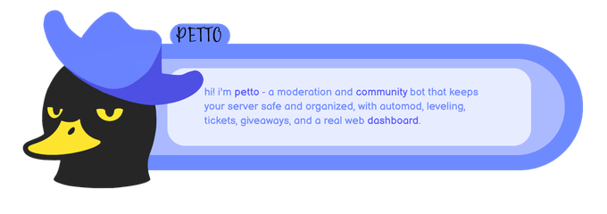
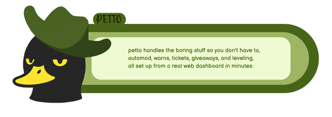
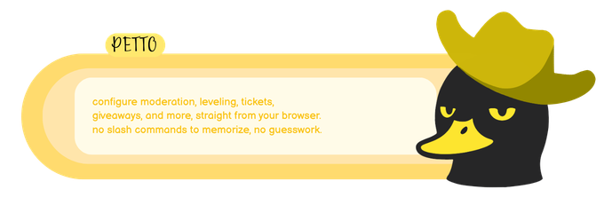

<div align="center">
  
  <h1>petto</h1>
  <p>A moderation and community bot built to keep Discord servers safe, organized, and pleasant to run.</p>
  <p>
    <a href="https://petto.sbs/dash">Dashboard</a> ·
    <a href="https://petto.sbs/support">Support</a> ·
    <a href="https://github.com/PettoBot/petto-wiki-docs">Documentation</a> ·
    <a href="CHANGELOG.md">Changelog</a>
  </p>
</div>

<div align="left">
  
</div>

## Overview

Petto is an English-first Discord bot focused on practical moderation and community management. It combines a configurable prefix command system with Discord's interactive panels, buttons, selects, and modals where they make configuration easier. Spanish support is planned for a future release.

<div align="left">
  
</div>

## What Petto includes

- **Moderation:** bans, kicks, mutes, warnings, cases, audit logs, AutoMod, anti-raid, anti-nuke, anti-alt, and honeypots.
- **Community:** leveling, ranks, leaderboards, giveaways, reaction roles, welcome/leave messages, boosts, and bump reminders.
- **Support:** tickets, staff controls, reports, and protected HTML transcripts.
- **Configuration:** embeds, custom commands, autoresponders, sticky messages, verification, and a web dashboard.
- **Recovery:** Petto Vault backups with server-scoped numbers, audited actions, scheduled backups, exports, and safe restores.

## Getting started

1. [Invite Petto](https://discord.com/oauth2/authorize?client_id=1786557964959&permissions=8&integration_type=0&scope=bot%20applications.commands) to your server.
2. Run `/setup` for the interactive initial configuration.
3. Use `!help` to browse the prefix command catalog. The prefix can be changed per server.
4. Open the [dashboard](https://petto.sbs/dash) when you prefer forms, toggles, and dropdowns over command syntax.

Most everyday commands use the server prefix. Discord interactions are reserved for setup flows and interactive UI such as panels, buttons, selects, and modals.

<div align="left">
  
</div>

## Quick examples

```text
!help
!lock #channel
!honeypot list
!backup panel
```

The complete command reference, permissions, environment setup, architecture notes, and deployment details are in the [technical reference](docs/REFERENCE.md).

## Development

```bash
npm ci
npm run check
npm run types:check
npm run build:ts
npm start
```

Petto currently runs as JavaScript/CommonJS. TypeScript is being adopted incrementally inside the same `src/` tree; the full JS/TS-to-`dist` migration is future work, not a requirement for current contributors.

## Contributing

Petto is maintainer-led. Read the [contribution guide](CONTRIBUTING.md), [AI-assisted development policy](AI_POLICY.md), [security policy](SECURITY.md), [code of conduct](CODE_OF_CONDUCT.md), and [DCO](DCO.md) before proposing a change.

Feature ideas and behavior changes should be discussed and accepted before implementation. Never commit credentials, environment files, private deployment data, or database exports.

## License

Petto is licensed under the [AGPL-3.0-only license](LICENSE).
